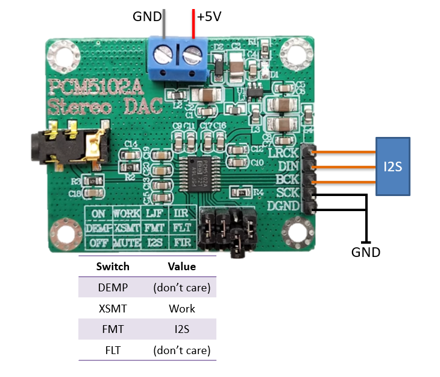

# TTS Demo Project

[中文版](index_cn.md)

Important: this project needs [external flash](https://ingchips.github.io/blog/2024-02-05-external-flash/).

Examples:

> 欢迎使用 ING916 桃芯语音合成。支付宝收款 916.80 元。

<audio controls>
<source src="example_data1.wav">
Your browser does not support the audio element
</audio>

> 京 A123456789，祝您一路顺风。

<audio controls>
<source src="example_data2.wav">
Your browser does not support the audio element
</audio>

Synthesized wave will be sent to UART or I2S, which is selected by `WAVE_SINK`:

|`WAVE_SINK`| Output             | Note                             |
|:---------:|:------------------:|:---------------------------------|
|    0      |  UART (Default)    |Python script `tts_demo.py` will play the wave. |
|    1      |  I2S               |Audio DAC with I2S is needed for playback. |

When I2S is selected as `WAVE_SINK`, an additional audio DAC with I2S is required for playback.
Take PCM5102A as an example:



Use Cube to find out which PIN are used as I2S.

## Test

1. Download to ING916 Dev-Board which has connected to external flash large enough for the voice definition;

1. Run [`tts_demo.py`](../../../../../tools/tts_demo.py). Suppose COM1 is used:

    ```sh
    python tts_demo.py COM1
    ```